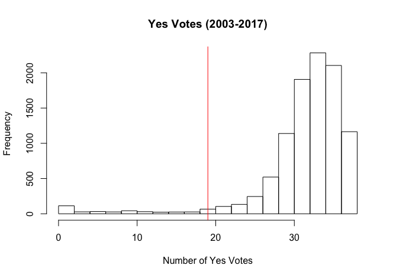

# Parity in the Senate
A data visualization of State Senate voting data created for an ECON1660 (Big Data)
final project at Brown University.  
Created By: Sean Segal, Nate Meyers, Ben Wesner

Checkout the final product at https://seansegal.github.io/parity-in-the-senate/

# Project Report
## Introduction

### Initial goals:
- Create a publicly available data set that contains the information from [rilegislature.gov](http://webserver.rilin.state.ri.us/votes/) in a more easy to use form (currently only one bill is viewable at a time).
- Create an accompanying website using [D3](https://d3js.org/) to present the data in an informative manner. Ideally the website will give an understanding of voting networks in the [Rhode Island Senate](https://en.wikipedia.org/wiki/Rhode_Island_Senate) as well as the partisanship present in the senate.
- Try and generalize this process to other states.

### The Visualization

1. Overview

The visualization shows the voting patterns of the senators as they relate to their peer senators in a given state over a given term. The state can be controlled using the "State" dropdown menu, and the term can likewise be controlled using the "Term" dropdown menu. The visualization can be panned and zoomed as needed, and each individual node can be moused over to display information about the senator it represents. The "More Information" dropdown gives a brief explanation of the graphic as a whole, and also presents relevant information about the current visualization. This includes which political party comprises the majority in the given senate, and histograms that show the distribution of parity values and senator similarity values.

2. The Aesthetics

The first aesthetic is node color, which corresponds to parity. We are defining "parity" as the relative frequency with which a senator votes with or against the majority of the senate. Specifically, a parity value of 0 indicates that the senator always votes with the majority on every bill, and a parity value of 1 indicates that the senator never votes with the majority on every bill. The corresponding colors are displayed in the "More Information" dropdown on the website. 

It is important to note that parity doesn't necessarily correspond to the actual party the senator belongs to. For example, if you take a look at the visualization for Montana 2017, you will see that although the senate is majority republican, there are both republican and democratic senators who often vote against the majority, and thus have high parity values. Additionally, it is important to note that although the parity distribution is different between every state and term, the range of color is always the same. That is, the nodes in each visualization are colored relative to the parities in just that visualization, not relative to other states or terms. In order to compare the general parity levels across differents states or terms, you should refer to the parity histogram in the "More Information" dropdown. For example, Rhode Island 2017 sees all senators having parity values between 0 and 0.05, which indicates that they generally vote together. Meanwhile in Florida 2017, most senators actually vote against the majority quite often, indicating that the individual senators (interstingly -- the republicans) don't vote in alignment with their party as often as senators do in Rhode Island 2017.

The second aesthetic is distance between nodes, which corresponds to senator similarity, or "weight". We are defining the weight between two senators to be the relative frequency with which those senators vote together. The weight will be equal to 1 if the two senators always vote together, and the weight will be 0 if the they never vote together. The visualization corresponds this weight to the distance between the nodes representing the two senators. That is, a high weight corresponds to a low distance, and vice versa. In this way, we can effectively see which senators tend to vote together -- the ones clustered together!

As with parity, it is important to note that the senator similarity distribution for a given state and term is mapped to the same range of distances, so that the longest distance in any two visualizations is the same. That means that the distances between senators are again relative to that specific state and term, not any other state or term. Use the senator similarity distribution histogram in the "More Information" dropdown to compare across different state/term visualizations.

## Process and Reflections:
1. Web Scraping

We began scraping data from [the RI Legislature website](http://webserver.rilin.state.ri.us/votes/). Initially, we found that we could only get data from 2014 onwards, but after playing around with an index on the website url, we found that we could view Senate votes from as early as 2003. Scraping proved to be a pretty difficult process; in addition to having to figure out how the indexing worked, we also had to figure out which votes were relevant (we needed to identify and exclude roll calls, etc.) and account for changes in the format the information was presented in.

Part way through the project, and after a lot of the scraping had been completed, we found a website called https://openstates.org/. Openstates collects data from every state senate and compiles it into a publicly available API. Initially, we felt silly for overlooking this massive website, but after trying to use the API we found some severe limitations and confusing errors. Of these, the two biggest problems were shorter data ranges (the earliest available data in most states was 2011) and data integrity (for some reason, when we pulled data for the Montana senate only contained votes in odd years, and when we pulled data for the Connecticut senate, we found only 28 senators when there should have been 36). While we like the idea behind Openstates, we hope their issues can be resolved in the near future, and we didn't feel comfortable making their API the centerpiece of the project.

In terms of mechanics, we used [Beautiful Soup](https://www.crummy.com/software/BeautifulSoup/) in Python to scrape from the RI Senate website, and we used the official Openstate python package ([pyopenstates]()http://docs.openstates.org/projects/pyopenstates/en/latest/) to make requests from the API (all other states).

2. Data Cleaning and Calculations

After scraping the data from the RI Senate website, we used R to reformat the data to be input into our website, the scripts can be found in the repository. In addition to reshaping the data, we also calculated a "weight" between each senator. The weight represents how many times a pair of senators agreed on a bill over the total number of times they voted together. This would result in senators with similar voting habits would have high weights (think two Democratic senators, for example) and senators with different voting habits would have low weights (think a Democratic Senator and a Republican Senator).

We soon realized that while this metric conveys some information, it is not particularly informative within the RI Senate. This is because the RI Senate is overwhelming dominated by Democrats (there are 38 active senators, and only 5 are Republicans), Democrats propose almost all of the bills in the data set, and Democrats almost always vote yes on the bills they propose. As a result, the weights we generated were almost always close to 1, and even for the most conservative senators, the weights were still pretty high. Below is a histogram demonstrating how the average Senate bill in our data set receives well over the 20 votes needed to pass legislation.

In addition to the weights, we also calculated a parity statistic for each senator. The idea behind this statistic was to determine how willing the senator is to go against the majority opinion in the senate. This was calculated by taking the number of votes the senator went against the majority over the total number of votes that the senator participated in. Similarly to the weights statistic, this wasn't a very revealing statistic in RI; most times Democrats sided with the majority, and the people who sided with the majority less were almost always republicans. Still, it appeared that most Republican RI Senators voted for Democratic bills the vast majority of the time.

The raw data for Rhode Island can be found in data/ri, while the data for all other states uses the OpenStates API and converts the data directly until the format used by the visualization -- found in docs/data.

3. Data Visualization Website

At the beginning of the project, we sat down and brainstormed a bunch of ideas we had for how to effectively visualize the Senate voting data. All three of use were interested in networks, and decided that the core visualization should be a graph with connections that would mimic some of the visualizations we had seen about the US Senate and Congress during the election. Outside of that, we wanted to be able to select specific date ranges for the visualization, have a couple panels of summary information surrounding the visualization, and also have ways to zoom in on different bills, senators, and networks.

As all grand visions go, we faced many significant challenges implementing these ideas, and were forced to make many compromises, though we do feel like we were able to deliver on most of our initial vision. The core network is nearly exactly how we had imagined; we even played around with different ways to make the visualization feel more alive and less static (notice how the nodes bounce into place when initialized).

Additionally, we wanted to show some summary statistics about the makeup of each senate term. We included the number of senators from each party, and then to see how polarized the senate is, we included histograms showing the distribution of parities and weights in the Senate. Below are the histograms we generate for Montana. The parity histogram shows what seems to be a bimodal distribution: there are a lot of senators who almost always vote with the majority (parity between 0-0.2, probably center-right politicians) and a group of senators that tend to oppose the majority more frequently (parity between 0.2-0.4, probably left and far-right politicians). The weight histogram for 2011 shows a more clear example of the bimodal distribution we expect from a senate with a near 50/50 right/left split.

	

	

When we started to think about how we could work with a date range, we initially wanted to make something where you could put in any range the user wanted to, and the visualization and summary panels would update accordingly. After playing around with a few options, we came to the conclusion that the easiest way to make that dynamic of a visualization would take a lot of time and involve some sort of backend that would update the weights and partisanship scores according to the input date range. As a result, we decided to limit the possible selections to the available years, and pre-compute the statistics for each year ahead of time so the results would be viewable instantly. We acknowledge that this is kind of cheating but we didn't have unlimited time to make all of our features perfect!!!!

We were able to get some information for each senator that pops up when you mouse over one of the nodes on the graph. Unfortunately, much of the data was unavailable or incomplete, so we had to do some data entry and support less fields. The only fields that were common across all senators in the data were full name, registered party, and the district they represent.

## Analysis
There are many applications of our final data visualization:

1. Comparisons of individual senators within a Senate, and identifing subnetworks of senators within the Senate. This can go beyond simply verifying that Democrats vote together and Republicans vote together.

2. Comparisons across state Senates to see how the voting patterns of highly polarized senates compare.

### Case Study: Montana vs Rhode Island

Below is the visualization of the Rhode Island senate. From the visualization, we can see that political parity in the RI Senate is very very low, and the senators almost always vote with the majority, both democrats and republicans. From the weight histogram, we can see that the vast majority of senators vote the same way as every other senator. This makes sense, as the senate contains 33 Democrats and 5 Republicans (the republicans are the 5 dots on the right of the visualization). In addition, we can see a few red dots to the left of the visualization, and these represent some of the most liberal members of the RI Senate:

	

Now we can look at the Montana senate. Montana has a much more even split in party affiliation than Rhode Island, with 15 Democrats and 31 Republicans. In the graph of the senate, the Republicans are the senators in the middle and to the right, and the Democrats are to the left. The centrist republicans are really easy to identify, as they have the white shading, indicating that they vote for most left leaning bills and most right leaning bills. We can also see that the Parity Distribution and the Senator Similarity Distribution have two peaks, with the smaller peak for the Democratic senators and the larger peak for the Republican senators:

	

## Future Directions & Improvements
- We would like to learn more about backend development and how some of the more dynamic visualizations we see on websites like 538 and NYTimes update so fast. This seems like a major obstacle for making dynamic visualizations, and would definitely improve our visualization if we knew how to do it. For example, we preprocessesed our data year by year but it would be cool if you could look at various year ranges. We could not do this, because we would need to precompute different files for every possible year range. If we had a backend, we could do this calculation on the backend depending on which data was requested by the user. 

- Working with the team managing the Open States API to fix small issues with data on some states. This would enable us to add more states to our visualization

- Finding a better method to get text data from bills. With this data, we could perform more interesting analysis using NLP.

- Add more data on each senator to the visualization. It would be interesting to have data on each Senator's financial contributers, maybe a short description scraped from their Wikipedia page (if they have one) and other information. This is quite difficult to do as there is no API for this information and would probably need to be compiled manually. 

- Visually show senator parity changes over time. We currently have all the information needed to see how a Senator's parity level changes over time but we do not have a way to display it. 

## Setup

### The Website

To run the website locally, go to the `docs` directory (`cd docs`) and run:

`python -m http.server 3000`

This will setup a local server for the website. You should now be able to visit http://localhost:3000 in your web browser and see our visualization running locally.

### Web Scraper/APIs
To run the open-states data pipeline, run 
` ./generate-complete-dataset.sh <state>`
where the state is the two letter code for that state. For example, to get data on Florida, run 
` ./generate-complete-dataset.sh fl`

For this the script to run on your computer you will need 
- Python 3
- Node 
- pyopenstates Python module
- R (with a few packages that you will be prompted to install)

## Contributing
Contributions are welcome from anyone! Please read our setup guide above to get started and open pull requests with any new additional features or bug fixes.

## License
MIT © Sean Segal, Nate Meyers, Ben Wesner 2017
